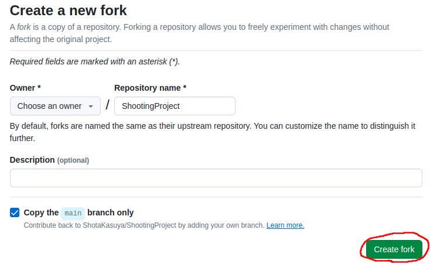
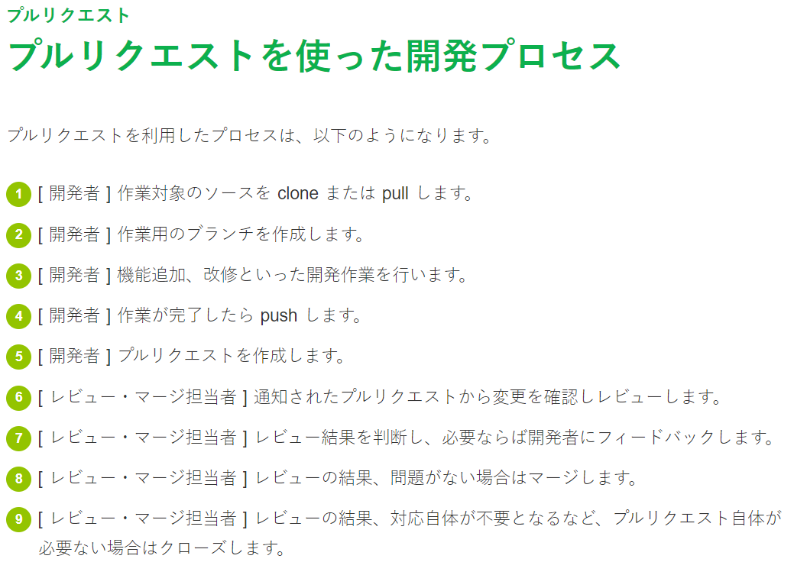

# 環境構築

## GitHubアカウント作成

1. [GitHub](https://github.com/)にアクセスする。
2. **サインアップ**をクリックする。
3. サイトの指定に従ってアカウントを作成。

## リポジトリをFork

この操作で、私が作成したリポジトリ(プログラム等を保存できる空間)を各々のアカウント用にコピーできます。

* 赤線の場所をクリック

* Create forkをクリック(任意で名前を変える)

GitHub上で自分用のリポジトリを作成しました。
次に、各々のPCにリポジトリを持っていく(Clone)の準備をします。

## GitGUIをインストール

ここでインストールするものは、
今回の作業だけでなくGitを利用する様々な場面で活用できます。
Gitそのものの操作はコマンドを利用するのですが、
コマンド操作は分かりづらいため今回は教えません。

[Gitについて](https://backlog.com/ja/git-tutorial/)

なので操作を手軽にできるアプリをインストールしてもらいます。

例：
* [GitKraken](https://www.gitkraken.com/)
* [Sourcetree](https://www.sourcetreeapp.com/)
* [GitHubDesktop](https://docs.github.com/ja/desktop/installing-and-authenticating-to-github-desktop/installing-github-desktop)
* [SourceControl(VSCode拡張機能)](https://code.visualstudio.com/docs/sourcecontrol/intro-to-git)

## ローカルにリポジトリをクローン

TODO

## プログラムを編集後プルリクエストを作成する

最終的な作業フロー
* ゲーム開発をする。
* 作業内容を[コミット](https://backlog.com/ja/git-tutorial/intro/03/)
* GitHubに[プッシュ](https://backlog.com/ja/git-tutorial/intro/09/)
* プルリクエストを作成

今回、プルリクエストを受け取って私が皆さんの進捗を把握する予定なので出来る限り頻繁にプルリクエストを送ってほしいです。